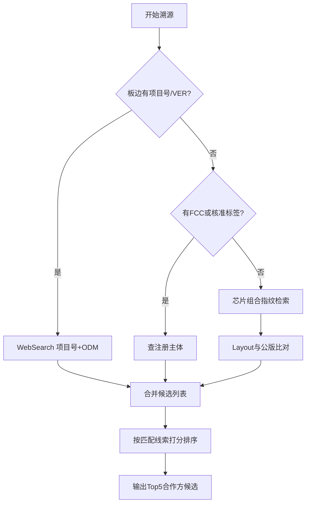

# ODM / 监管溯源指南

当判定为轻度定制、深度定制或疑似自研时，按本指南缩小合作方范围。不维护易过期的 ODM 硬编码名单，只使用**检索模式**。

## 溯源决策树



## 1. PCB 丝印溯源

### 看哪里

- 板边长丝印区：版本 `VER x.x`、料号 `PN:`、日期 `DATE`
- 项目代号：如 `PRJ-XXXX`、`{品牌缩写}_MB_V1.0`、`Designed by xxx`
- 金手指/测试点旁的小字

### 检索模式

```
"{完整项目号}" ODM
"{完整项目号}" 方案 开发
"{板边PN}" PCB 设计
inurl:fcc.gov "{项目号}"
```

### 输出要求

找到项目号时，报告写明：原文 → 推测归属（方案厂/品牌工程部）→ 置信度。

## 2. FCC / 监管查询

### 美国 FCC

1. 从外壳铭牌、电池仓、包装盒找到 **FCC ID**（形如 `2ABCD-XYZ123`）
2. WebSearch：`site:fcc.gov "{FCC ID}"` 或 `fccid.io "{FCC ID}"`
3. 读取 **Grantee**（持证方）— 常为 ODM 或品牌母公司；**Model** 对应具体 SKU

### 中国 SRRC / 型号核准

1. 找 `CMIIT ID` 或「型号核准代码」
2. WebSearch：`"{CMIIT ID}" OR "{核准代码}" 型号核准 申请单位`
3. 申请单位常为 ODM 或品牌

### 欧盟 / 其他

- CE 声明中的 Manufacturer / Responsible person 可作辅助，权重低于 FCC/SRRC

### 注意

- Grantee 不一定是最终方案商（可能是品牌），需结合 PCB 项目号交叉验证
- 找不到 ID 时，在「下一步验证」中请用户补拍铭牌

## 3. 芯片组合指纹

将板上关键 IC 组合成「指纹串」检索：

```
"{主控候选}" "{充电IC}" "{触控IC}" turnkey
"{主控候选}" "{充电IC}" 公版 方案 TWS
"{主控候选}" reference design 耳机
```

### 指纹选取原则

- 必选：主控（或磨标时的 Top1 候选）
- 优选：充电 IC、触控、独立 MCU（仓板）
- 辅助：Flash 容量级、电量计型号

若检索命中某方案商宣传稿或公版介绍，记为强线索（置信度可到中-高）。

## 4. Layout 与公版比对

### 比对点

- 主控相对 Flash、晶振、天线的位置
- 充电 IC 相对 Type-C 和电池座的布局
- 屏蔽罩形状与分区
- 板外形与螺丝孔位

### 检索模式

```
"{品类}" "{主控系列}" 公版 布局
"{方案商名}" {品类} demo board
site:52audio.com "{主控型号}" 拆解
```

与公开拆解图高度一致 → 倾向公版/Turnkey，合作方为「任意具备该公版的方案厂」，缩小到检索命中的厂商。

## 5. 合作方缩小（磨标 + 深度定制）

当主控磨标且布局非标准公版时：

1. 用**外围指纹**（充电 + 触控 + Flash + IMU 组合）WebSearch 过往拆解
2. 用**产品品类 + 售价档 + 上市地区**过滤：`"{品类}" "{价位}" 拆解 方案`
3. 查品牌历史供应商：若品牌曾公开过供应商合作新闻，检索 `"{品牌}" ODM 合作 硬件`
4. 列出最多 **5 家候选**，每家格式：

```markdown
### {公司名}
- 匹配线索：{芯片组合/项目号/FCC/布局中的哪几条}
- 公开案例：{同类产品拆解或新闻，附链接}
- 不确定项：{为何不能确认}
```

**禁止**在无依据时断言「就是某 ODM 做的」。

## 6. 判定档位与输出映射

| 档位 | 定义 | 合作方输出 |
|------|------|------------|
| 公版 | 标准丝印 + 公版 Layout | 「任意 {N} 家具备公版的方案厂」+ 检索命中的优先列 |
| 轻度定制 | 公版硬件 + 定制固件/外壳 | 公版方案商 + 可能的品牌联合调试 |
| 深度定制 | 磨标/定制丝印 + 非标准 Layout | Top 5 ODM 候选 + 验证步骤 |
| 疑似自研 | 品牌独有 PCB 形状 + 定制芯片组合 | 品牌工程部或独家 ODM + 强依据才写 |

## 7. 引导用户补充的信息

按性价比排序，每次最多请用户补 **1–2 项**：

1. 外壳铭牌 / FCC ID / CMIIT ID 照片
2. 充电仓/副板照片
3. 产品官方型号、售价、上市时间
4. 包装盒或说明书上的制造商信息
5. 已知竞品对标型号
